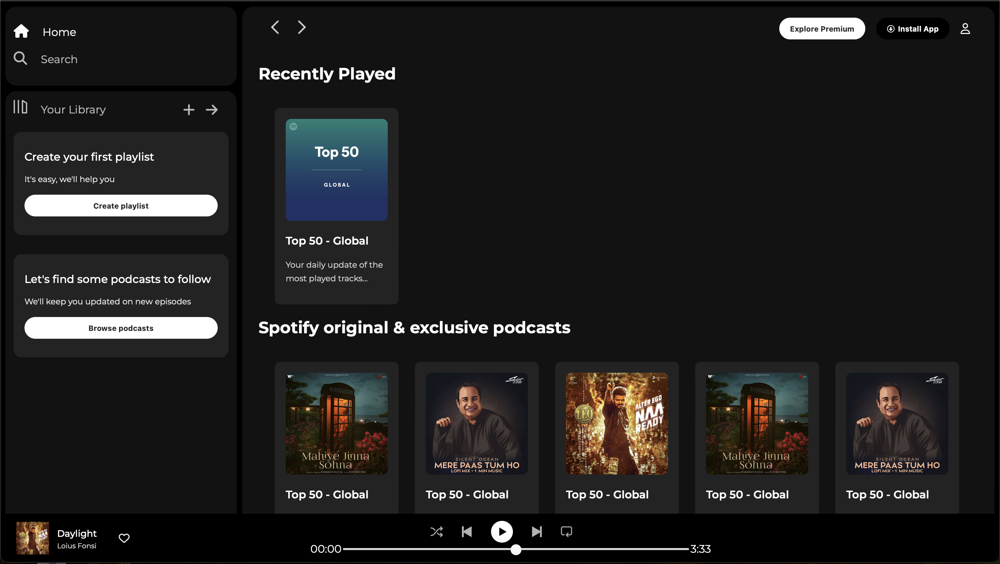

# Spotify-Clone

As a part of learning web development, I created a static clone of the Spotify web interface using HTML and CSS only. This project is designed to showcase my front-end layout and styling skills. The website is responsive and mimics the UI of Spotify.

There is no JavaScript used in this project - it focuses purely in the structure and design.

## Tech Stack

## Features-

- Sidebar: Fully styled sidebar with hover effects, icons, and consistent color scheme, just like the original Spotify interface.
- Sticky Nav-bar: The top bar stays fixed while scrolling the content
- Card-based layout: A responsive flexbox of cards for playlists,albums and podcast recommendations.
- Music Player: A bottom sticky music bar with track info, media control buttons and a progress bar.

## How to Run

### Option 1: Run locally

1. Clone this repository or download the ZIP
2. Open the folder in your code editor
3. Open `index.html` in your browser

### Option 2: View Live

experience.

### Option 2: View Live

This project is hosted on GitHub Pages:  
👉 [Live Demo](https://your-username.github.

## Screenshot

